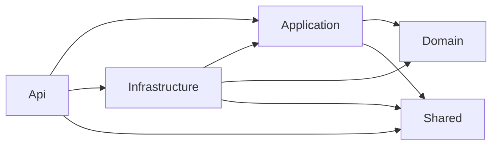
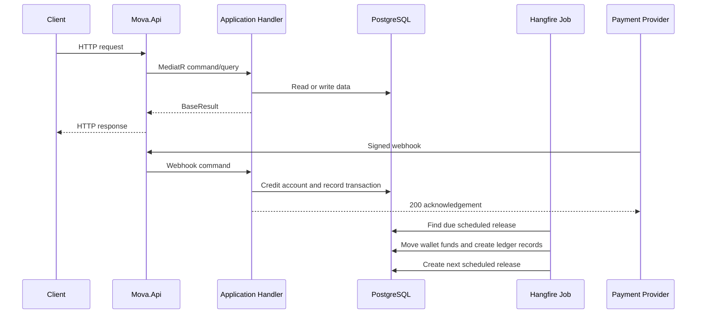

# Mova Project Walkthrough

## 1. What Mova Is

Mova is a scheduled-wallet platform. A user deposits money into a main account, creates a wallet with a target amount, chooses how that money should be released over time, and receives each release into the wallet's available balance.

The core idea is:

1. A user creates an account.
2. Deposits increase the user's main balance.
3. The user creates a wallet and chooses a target amount and release rule.
4. The target amount is reserved from the user's main balance.
5. Mova creates the first scheduled release only.
6. Hangfire processes that release when its date arrives.
7. The job creates the next release from the wallet rule.
8. This continues until the wallet reaches its target.

Mova is therefore both:

- A digital wallet system.
- A scheduling engine for controlled fund releases.

## 2. Solution Structure

The solution is divided into six projects:

```text
Mova.Api             HTTP endpoints, authentication pipeline, middleware, Swagger
Mova.Application     Commands, queries, interfaces, request-level business flows
Mova.Domain          Entities, enums, value objects, core business concepts
Mova.Infrastructure  EF Core, PostgreSQL, identity, payments, notifications, Hangfire jobs
Mova.Shared          Results, constants, exceptions, structured operation logging
Mova.Tests            Automated tests
```

### Dependency direction



The Domain project should remain independent of HTTP, databases, Hangfire, and payment providers. Infrastructure implements interfaces defined by Application.

## 3. Main Runtime Flow



## 4. Project Layers

### Mova.Api

This is the entry point. It is responsible for:

- Starting ASP.NET Core.
- Loading `.env.dev` or `.env.prod`.
- Registering controllers and JSON settings.
- Registering middleware.
- Enabling authentication and authorization.
- Exposing Swagger.
- Starting Hangfire's dashboard and recurring jobs.

The application starts in [Program.cs](Mova.Api/Program.cs). Service registration and middleware configuration are in [Startup.cs](Mova.Api/Startup.cs).

### Mova.Application

This layer contains request use cases:

- Commands change state.
- Queries read state.
- Interfaces describe required infrastructure capabilities.
- Handlers coordinate validation, persistence, and response creation.

MediatR dispatches commands and queries from controllers to their handlers.

### Mova.Domain

This layer contains the business vocabulary:

- `User`
- `Wallet`
- `WalletRule`
- `ScheduledRelease`
- `Transaction`
- `LedgerEntry`
- `VirtualAccount`
- `Money`
- Frequency and status enums

The `Money` value object stores minor units and currency. For NGN, NGN 100.50 is stored as 10050 minor units. This avoids floating-point money errors.

### Mova.Infrastructure

This layer implements external concerns:

- PostgreSQL and EF Core.
- ASP.NET Identity.
- JWT tokens.
- Redis caching.
- Paystack and Flutterwave webhooks.
- Email and SMS providers.
- Hangfire background jobs.
- Schedule and wallet-rule calculations.

### Mova.Shared

This layer contains shared application primitives:

- `BaseResult` and `BaseResult<T>` API responses.
- Constants.
- Shared exceptions.
- `OperationLogger` for operation lifecycle logging.

## 5. Authentication and Account Lifecycle

### Registration

Endpoint:

```text
POST /api/v1/auth/register
```

The registration handler:

1. Validates and normalizes input.
2. Checks email and phone uniqueness.
3. Creates the Identity user.
4. Assigns the default role.
5. Generates and stores an OTP.
6. Commits the database transaction.
7. Queues email and SMS delivery in Hangfire.
8. Returns the new public user ID.

Notification delivery happens after the database commit. A slow SMTP or SMS provider does not hold the registration request open.

### Account verification

Endpoint:

```text
POST /api/v1/auth/verify-account
```

The handler validates the OTP, marks the account as verified, creates a virtual account, commits the changes, and queues the welcome email.

### Login and tokens

Endpoints:

```text
POST /api/v1/auth/login
POST /api/v1/auth/refresh-token
POST /api/v1/auth/logout
```

JWT access tokens are used for API authentication. Web clients can also receive authentication cookies. Refresh tokens are stored and revoked through the identity/persistence layer.

### Password recovery

Endpoints:

```text
POST /api/v1/auth/forget-password
POST /api/v1/auth/verify-forget-password
POST /api/v1/auth/reset-password
```

The reset OTP is stored before delivery is queued. The response does not depend on email or SMS completion.

## 6. User and Wallet Balances

The user has a main account balance. A wallet has separate balances:

```text
TargetAmount          Total amount allocated to the wallet
FundedAmount          Total amount funded into the wallet
LockedAmount          Amount not yet released
AvailableAmount       Current release window amount available for use
UnusedAmount          Previous release windows not withdrawn before replacement
TotalReleasedAmount   Cumulative amount released from locked funds
TotalWithdrawnAmount  Cumulative amount withdrawn by the user
```

### Wallet creation money flow

Suppose the user has NGN 50,000 and creates a wallet with a target of NGN 30,000:

```text
User balance before:  NGN 50,000
Wallet target:        NGN 30,000
User balance after:   NGN 20,000
Wallet locked:        NGN 30,000
Wallet available:     NGN 0
```

The debit and wallet creation happen inside one database transaction. If wallet creation fails, the balance debit is rolled back.

## 7. Wallet Creation

Endpoint:

```text
POST /api/v1/wallet/create
```

The command performs this sequence:

1. Validate wallet name and amount values.
2. Normalize frequency configuration JSON.
3. Check for an existing active wallet with the same name.
4. Use `ISchedulePreviewService` only to validate the requested schedule and calculate its end date.
5. Begin a database transaction.
6. Debit the user's main balance by the target amount.
7. Save the wallet.
8. Save the wallet rule.
9. Call `IWalletRuleService.GetNextReleaseAsync()` exactly once.
10. Save only the first scheduled release.
11. Commit the transaction.
12. Return the wallet ID and first release date.

A successful response contains data like:

```json
{
  "message": "Wallet created successfully.",
  "data": {
    "walletId": 42,
    "firstReleaseDate": "2026-09-07T10:30:00+01:00"
  }
}
```

The command intentionally does not create every future release. This keeps wallet creation fast and lets the background job create one next release at a time.

## 8. Frequency Rules

The supported values are:

```text
1 Once
2 Daily
3 Weekly
4 Monthly
5 Quarterly
6 Yearly
7 Custom
```

A frontend may send enum values as numbers or names. Enum names are case-insensitive. Frequency configuration property names are normalized, so values such as `daysOfWeek`, `daysofweek`, and `DAYSOFWEEK` are accepted.

The frequency configuration is stored as JSON in `WalletRule.FrequencyConfig`.

### Rule service

`IWalletRuleService` is responsible for one focused operation:

```csharp
GetNextReleaseAsync(WalletRule rule, DateTimeOffset after, CancellationToken cancellationToken)
```

It returns the next date and amount only. It does not create database records and does not generate a full preview.

### Preview service

`ISchedulePreviewService` is for validation and user-facing previews. It calculates information such as:

- Whether a configuration is valid.
- Total releases.
- First release date.
- True computed end date.
- Sample release dates.
- Warnings.

Preview samples may be limited by `maxReleases`; `ComputedEndDate` represents the full schedule, not only the displayed sample.

## 9. Scheduled Release Lifecycle

A scheduled release has one of these states:

```text
Scheduled   Waiting for its date
Processing  Currently being handled
Released    Successfully processed
Failed      Permanently failed after retry limit
Cancelled   Intentionally cancelled
```

### Hangfire process

`ProcessScheduledReleasesJob` runs every minute:

1. Finds up to 100 due `Scheduled` releases.
2. Opens a database transaction for each release.
3. Reloads the release and wallet.
4. Skips stale or already-processed rows.
5. Verifies the wallet is active.
6. Verifies enough locked money remains.
7. Moves the previous available amount into `UnusedAmount`.
8. Moves the current release amount from `LockedAmount` to `AvailableAmount`.
9. Increases `TotalReleasedAmount`.
10. Creates a release transaction.
11. Creates a ledger entry.
12. Marks the scheduled release as `Released`.
13. Creates the next scheduled release using `IWalletRuleService`.
14. Commits all changes together.

Example:

```text
Before release:
LockedAmount:          NGN 23,000
AvailableAmount:       NGN 7,000
UnusedAmount:          NGN 0

Current release:       NGN 7,000

After release:
LockedAmount:          NGN 16,000
AvailableAmount:       NGN 7,000
UnusedAmount:          NGN 7,000
```

The job stops creating future releases when:

```text
TotalReleasedAmount >= TargetAmount
```

### Retry behavior

Each scheduled release has `FailedAttempts`:

- First failure: returned to `Scheduled`.
- Second failure: returned to `Scheduled`.
- Third failure: marked `Failed`.

The retry counter is persisted in PostgreSQL by the `AddFailedAttemptsToScheduledReleases` migration.

## 10. Payments and Webhooks

Webhook endpoints:

```text
POST /api/v1/webhook/paystack
POST /api/v1/webhook/flutterwave
```

### Paystack

The Paystack flow:

1. Reads the raw request bytes.
2. Validates the `x-paystack-signature` HMAC-SHA512 signature.
3. Deserializes the payload.
4. Verifies successful NGN transactions.
5. Finds the active Paystack virtual account.
6. Checks the transaction reference.
7. Credits the user's main balance.
8. Creates a deposit transaction and ledger entry.
9. Commits atomically.

### Flutterwave

The Flutterwave flow uses:

- `flutterwave-signature`.
- HMAC-SHA256 with base64 output.
- `charge.completed` events.
- Flutterwave virtual-account details in the bank-transfer payload.

### Idempotency

Both providers use the transaction reference as an idempotency key. The database also has a unique non-null reference index. Duplicate deliveries return a successful already-processed response and do not credit the user twice.

## 11. Ledger and Transactions

A `Transaction` records the business event:

```text
Deposit
Release
Withdrawal
Refund
Reversal
```

A `LedgerEntry` records the accounting side of that event. Transaction and ledger records are written in the same database transaction as the balance change.

The normal release relationship is:

```text
ScheduledRelease
        |
        +--> Transaction(Type = Release)
                    |
                    +--> LedgerEntry(IsCredit = false)
```

## 12. Background Notifications

Email and SMS are not part of the critical database request path.

The application queues these actions after successful commits:

- Registration OTP email.
- Registration OTP SMS.
- Verification resend email.
- Verification resend SMS.
- Password-reset email.
- Password-reset SMS.
- Welcome email.

Email and SMS are separate Hangfire jobs. This means an SMS retry does not resend an email that already succeeded.

Each notification job has automatic retry support.

## 13. Logging

Request and business operations use `OperationLogger`:

```csharp
using var op = OperationLogger.Start(
    _logger,
    "OperationName",
    ("Key", value));
```

The operation logger records:

- Operation name.
- Start time.
- Context properties.
- Success or failure.
- Duration.
- Exception details when applicable.

Direct `_logger.Log...` calls should not be used for application operations. The codebase uses operation logging for commands, cache operations, email operations, notification jobs, and scheduled-release jobs.

## 14. Persistence

PostgreSQL is the primary database. EF Core maps:

- Identity users and roles.
- Wallets and wallet rules.
- Scheduled releases.
- Transactions and ledger entries.
- OTP verification records.
- Refresh tokens.
- Virtual accounts.

Enums are stored as integer columns. The API can accept enum names or numbers, but the database stores the numeric enum value.

Money is stored as:

```text
amount_currency
amount_minor_units
```

This makes financial calculations deterministic and avoids floating-point storage.

## 15. Redis Cache

Redis is used by `RedisCacheService` for:

- Cache-aside reads.
- Distributed locking during cache population.
- Cache deletion.
- Prefix deletion.

Cache operations also use `OperationLogger` and support cancellation and timeouts.

## 16. Hangfire

Hangfire uses PostgreSQL storage and runs the background server in the API process.

The dashboard is available at:

```text
/hangfire
```

The recurring scheduled-release job is registered with the DI-backed `IRecurringJobManager`. Static Hangfire APIs are avoided so startup does not depend on `JobStorage.Current` being initialized.

## 17. API Surface

### Authentication

```text
POST /api/v1/auth/register
POST /api/v1/auth/verify-account
POST /api/v1/auth/resend-verification-token
POST /api/v1/auth/login
POST /api/v1/auth/refresh-token
POST /api/v1/auth/logout
POST /api/v1/auth/forget-password
POST /api/v1/auth/verify-forget-password
POST /api/v1/auth/reset-password
```

### Wallets

```text
POST /api/v1/wallet/preview
POST /api/v1/wallet/create
```

Wallet creation requires authentication. Schedule preview is currently anonymous so a frontend can validate a proposed schedule before creating a wallet.

### Webhooks

```text
POST /api/v1/webhook/paystack
POST /api/v1/webhook/flutterwave
```

Webhook requests are authenticated by provider signatures, not user JWTs.

## 18. Configuration and Startup

Startup expects:

- `.env.dev` for development.
- `.env.prod` for production.
- PostgreSQL connection string named `Postgres`.
- Redis connection string named `Redis`.
- JWT settings.
- Email settings.
- Paystack settings.
- Flutterwave secret hash.

The application loads environment variables before building the service provider. Missing required environment files or connection strings stop startup deliberately.

## 19. Running the Project

From the repository root:

```powershell
dotnet restore Mova.sln
dotnet build Mova.sln
dotnet run --project Mova.Api/Mova.Api.csproj
```

Apply migrations with:

```powershell
dotnet ef database update `
  --project Mova.Infrastructure/Mova.Infrastructure.csproj `
  --startup-project Mova.Api/Mova.Api.csproj
```

The exact environment file and database credentials must be available before starting the API.

## 20. Typical End-to-End Scenario

1. A user registers.
2. Identity data and verification OTP are committed.
3. Email and SMS OTP jobs are queued.
4. The user verifies the account.
5. A virtual account is created.
6. Paystack or Flutterwave sends a signed successful-payment webhook.
7. The webhook credits the user's main balance exactly once.
8. The user previews a wallet schedule.
9. The user creates a wallet for NGN 30,000.
10. NGN 30,000 is debited from the main balance and locked in the wallet.
11. Only the first scheduled release is stored.
12. Hangfire processes that release when due.
13. The released amount becomes available for the current release window.
14. Any previous unwithdrawn available amount moves to `UnusedAmount`.
15. The next release is created from the wallet rule.
16. The process repeats until the target amount is reached.

## 21. Important Design Rules

- Never credit a payment webhook without verifying its signature.
- Never process a payment twice; references are idempotency keys.
- Never debit a user's main balance outside a transaction with the wallet creation.
- Never create the complete future schedule during wallet creation.
- Use `IWalletRuleService` for one next release.
- Use `ISchedulePreviewService` for validation and previews.
- Keep email and SMS outside the request's critical path.
- Keep money in `Money`; do not use floating-point storage for balances.
- Use `OperationLogger` for operation lifecycle logging.
- Store internal exception details in logs, not user-facing response messages.
- Stop creating releases once the wallet target is reached.
- Retry failed releases only up to the persisted retry limit.

## 22. Current Extension Points

The project can grow by adding:

- Wallet withdrawal commands.
- Wallet balance and transaction queries.
- Refund and reversal webhook handling.
- A reconciliation job for provider transactions.
- Notification delivery history.
- More payment providers using the existing provider abstraction.
- Explicit wallet completion and closure rules.
- Automated tests around money movement and idempotency.
