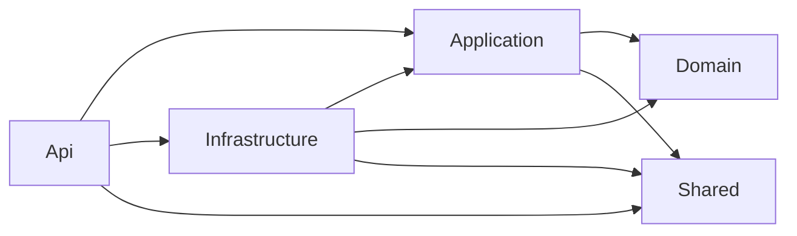
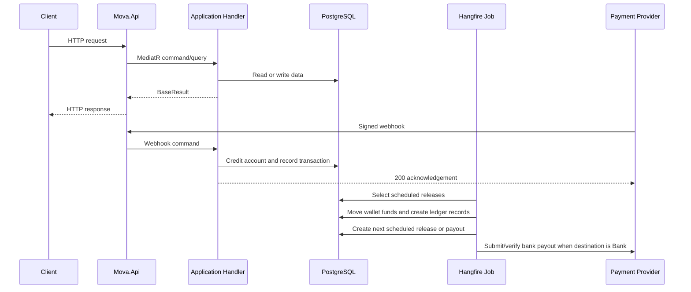

# Mova Project Walkthrough

## 1. What Mova Is

Mova is a scheduled-wallet platform. A user funds a main account, creates a wallet with a target amount, chooses how funds should be released over time, and selects whether each release goes to the wallet's available balance, the main MOVA balance, or a linked bank account.

The core idea is:

1. A user creates an account.
2. Deposits increase the user's main balance.
3. The user creates a wallet and chooses a target amount and release rule.
4. The target amount is funded from the user's main balance, with applicable upfront fees charged.
5. Mova creates the first scheduled release only.
6. Hangfire processes scheduled releases.
7. Wallet-destination releases increase the wallet's available balance; main and bank destinations create payout records for the payout processor.
8. After processing a release, the job creates the next release from the wallet rule.
9. This continues until the wallet reaches its target.

Mova is therefore both:

- A digital wallet system.
- A scheduling engine for controlled fund releases.

## 2. Solution Structure

The solution is divided into six projects:

```text
Mova.Api             HTTP endpoints, authentication pipeline, middleware, Swagger
Mova.Application     Commands, queries, interfaces, request-level business flows
Mova.Domain          Entities, enums, value objects, core business concepts
Mova.Infrastructure  EF Core, PostgreSQL, identity, payments, notifications, Hangfire jobs
Mova.Shared          Results, constants, exceptions, structured operation logging
Mova.Tests            Automated tests
```

### Dependency direction


```mermaid
flowchart LR
    Api --> Application
    Api --> Infrastructure
    Api --> Shared
    Application --> Domain
    Application --> Shared
    Infrastructure --> Application
    Infrastructure --> Domain
    Infrastructure --> Shared
```

The Domain project should remain independent of HTTP, databases, Hangfire, and payment providers. Infrastructure implements interfaces defined by Application.

## 3. Main Runtime Flow


```mermaid
sequenceDiagram
    participant Client
    participant API as Mova.Api
    participant Command as Application Handler
    participant DB as PostgreSQL
    participant Job as Hangfire Job
    participant Provider as Payment Provider

    Client->>API: HTTP request
    API->>Command: MediatR command/query
    Command->>DB: Read or write data
    Command-->>API: BaseResult
    API-->>Client: HTTP response

    Provider->>API: Signed webhook
    API->>Command: Webhook command
    Command->>DB: Credit account and record transaction
    Command-->>Provider: 200 acknowledgement

    Job->>DB: Select scheduled releases
    Job->>DB: Move wallet funds and create ledger records
    Job->>DB: Create next scheduled release or payout
    Job->>Provider: Submit/verify bank payout when destination is Bank
```

## 4. Project Layers

### Mova.Api

This is the entry point. It is responsible for:

- Starting ASP.NET Core.
- Loading `.env.dev` or `.env.prod`.
- Registering controllers and JSON settings.
- Registering middleware.
- Enabling authentication and authorization.
- Exposing Swagger.
- Starting Hangfire's dashboard and recurring jobs.

The application starts in [Program.cs](Mova.Api/Program.cs). Service registration and middleware configuration are in [Startup.cs](Mova.Api/Startup.cs).

### Mova.Application

This layer contains request use cases:

- Commands change state.
- Queries read state.
- Interfaces describe required infrastructure capabilities.
- Handlers coordinate validation, persistence, and response creation.

MediatR dispatches commands and queries from controllers to their handlers.

### Mova.Domain

This layer contains the business vocabulary:

- `User`
- `Wallet`
- `WalletRule`
- `ScheduledRelease`
- `Transaction`
- `LedgerEntry`
- `VirtualAccount`
- `Money`
- Frequency and status enums

The `Money` value object stores minor units and currency. For NGN, NGN 100.50 is stored as 10050 minor units. This avoids floating-point money errors.

### Mova.Infrastructure

This layer implements external concerns:

- PostgreSQL and EF Core.
- ASP.NET Identity.
- JWT tokens.
- Redis caching.
- Paystack and Flutterwave deposit webhooks.
- Paystack, Monnify, and Flutterwave bank-transfer payout integrations.
- Email and SMS providers.
- Hangfire background jobs.
- Schedule and wallet-rule calculations.

### Mova.Shared

This layer contains shared application primitives:

- `BaseResult` and `BaseResult<T>` API responses.
- Constants.
- Shared exceptions.
- `OperationLogger` for operation lifecycle logging.

## 5. Authentication and Account Lifecycle

### Registration

Endpoint:

```text
POST /api/v1/auth/register
```

The registration handler:

1. Validates and normalizes input.
2. Checks email and phone uniqueness.
3. Creates the Identity user.
4. Assigns the default role.
5. Generates and stores an OTP.
6. Commits the database transaction.
7. Queues email and SMS delivery in Hangfire.
8. Returns the new public user ID.

Notification delivery happens after the database commit. A slow SMTP or SMS provider does not hold the registration request open.

### Account verification

Endpoint:

```text
POST /api/v1/auth/verify-account
```

The handler validates the OTP, marks the account as verified, creates a virtual account, commits the changes, and queues the welcome email.

### Login and tokens

Endpoints:

```text
POST /api/v1/auth/login
POST /api/v1/auth/refresh-token
POST /api/v1/auth/logout
```

JWT access tokens are used for API authentication. Web clients can also receive authentication cookies. Refresh tokens are stored and revoked through the identity/persistence layer.

### Password recovery

Endpoints:

```text
POST /api/v1/auth/forgot-password
POST /api/v1/auth/verify-forget-password
POST /api/v1/auth/reset-password
POST /api/v1/auth/change-password
GET  /api/v1/auth/profile
PUT  /api/v1/auth/notification-preferences
```

The reset OTP is stored before delivery is queued. The response does not depend on email or SMS completion.

### Transaction PIN

Authenticated transaction-PIN endpoints are under `/api/v1/security/pin`:

```text
POST /api/v1/security/pin/set
POST /api/v1/security/pin/verify
PUT  /api/v1/security/pin/change
GET  /api/v1/security/pin/has-pin-setup
POST /api/v1/security/pin/forgot-pin-send
POST /api/v1/security/pin/forgot-pin-verify
```

The PIN service requires exactly six numeric digits for setup/change and stores an ASP.NET Identity password hash, not the raw PIN. Reset clears the existing PIN hash after the recovery flow. PIN verification is a separate operation from wallet release scheduling.

Three incorrect PIN attempts within the one-hour attempt window trigger a one-hour lock. The verification endpoint responds with HTTP 423 and sends a security email when the lock is first triggered; further attempts during the lock receive the retry guidance without duplicate emails.

The `set` and `verify` requests send an RSA-OAEP/SHA-256 encrypted Base64 value in `pin`; the `change` request sends encrypted Base64 values in `currentPin` and `newPin`. The API decrypts these values before applying the existing six-digit validation and PIN hashing. Configure the matching private key on the backend as `PIN_ENCRYPTION_PRIVATE_KEY`, either as PEM contents, a path to a readable PEM key file, or Base64-encoded PKCS#8 key data. Keep this private key out of the frontend and source control; the frontend uses only the corresponding public key in `VITE_PIN_ENCRYPTION_PUBLIC_KEY`.

## 6. User and Wallet Balances

The user has a main account balance. A wallet has separate balances:

```text
TargetAmount          Total amount allocated to the wallet
FundedAmount          Total amount funded into the wallet
LockedAmount          Amount not yet released
AvailableAmount       Accumulated amount available in the wallet destination
TotalReleasedAmount   Cumulative amount released from locked funds
TotalWithdrawnAmount  Cumulative amount withdrawn from the wallet
ResetAmount           Cumulative amount released in the current wallet cycle
```

### Wallet creation money flow

Suppose the user has NGN 50,000 and creates a wallet with a target of NGN 30,000:

```text
User balance before:  NGN 50,000
Wallet target:        NGN 30,000
Upfront fees:         Calculated from target, destination, release amount, and release count
User balance after:   NGN 50,000 - NGN 30,000 - upfront fees
Wallet locked:        NGN 30,000
Wallet available:     NGN 0
```

The debit, wallet, wallet rule, first release, creation transaction, ledger entry, and MOVA-fee transaction are saved within the unit-of-work transaction. If wallet creation fails, the balance debit is rolled back. Current validation requires a target of at least ₦2,000, a release amount of at least ₦100 not greater than the target, a valid category, and a supported destination. Bank destination additionally requires the customer's own active bank account and consent. Bank destinations include a per-release payout fee in the upfront charge; wallet and main destinations do not. Current `WalletFeeHelper` calculates a creation fee of `floor(target * 1.3%) + ₦5`. Bank payout fees are per release: ₦10 for a release up to ₦5,000, ₦25 up to ₦50,000, and ₦50 above that; a further ₦50 stamp duty is included for a release of at least ₦10,000. Wallet and Main destinations have no payout fee in this helper.

### Wallet behavior rules

A wallet separates money by purpose and lifecycle:

```text
LockedAmount        Money waiting for a future scheduled release
AvailableAmount     Money accumulated in this wallet for the Wallet payout destination
FundedAmount        Total principal funded into the wallet
TotalReleasedAmount Cumulative money released from locked funds
TotalWithdrawnAmount Cumulative amount withdrawn from this wallet
ResetAmount         Amount released during the current wallet cycle
```

`UnusedAmount` is not a persisted property on the current `Wallet` entity. The balance fields are not interchangeable: bank and main destinations are represented by payout records and their processing state, rather than being added to `AvailableAmount`.

#### Example: NGN 30,000 released by NGN 7,000

When the wallet is created:

```text
FundedAmount:          NGN 30,000
LockedAmount:          NGN 30,000
AvailableAmount:        NGN 0
TotalReleasedAmount:   NGN 0
```

Only the first release is stored initially. The release job creates the next release after each successful release.

The release sequence is:

```text
Release 1: NGN 7,000
Release 2: NGN 7,000
Release 3: NGN 7,000
Release 4: NGN 7,000
Release 5: NGN 2,000
Total:     NGN 30,000
```

When a Wallet-destination release is processed, the amount is removed from `LockedAmount` and added to `AvailableAmount`. Existing available funds remain there; the current job does not roll them into a separate unused balance or replace the available balance:

```text
Before next release:
AvailableAmount: NGN 7,000
LockedAmount:    NGN 23,000

After the next NGN 7,000 release:
AvailableAmount: NGN 14,000
LockedAmount:    NGN 16,000
```

For Bank and Main destinations, the release job creates a pending payout instead of increasing wallet available balance. The payout job later sends bank transfers through the enabled provider or credits the customer's main balance. The final release amount is capped to the remaining locked amount. When no locked amount remains after a release, the wallet is marked completed and no further release is scheduled; renewal automation may then be attempted.

#### Relocking funds

`RelockUnusedFundsCommand` exists, but its route is commented out in `WalletController`. It is not currently available through the public wallet API. The current wallet schema also has no `UnusedAmount` field, so the walkthrough's previous unused-funds example does not describe current persisted wallet behavior.

## 7. Wallet Creation

Endpoint:

```text
POST /api/v1/wallets/create
```

The command performs this sequence:

1. Validate wallet name and amount values, payout destination, category, and destination-specific bank requirements.
2. Normalize frequency configuration JSON.
3. Check for an existing active wallet with the same name.
4. Use `ISchedulePreviewService` to validate the schedule and determine the release count.
5. Calculate the creation fee and, for Bank destination, per-release payout fees.
6. Begin a database transaction and debit target plus upfront fees from the main balance.
7. Save the wallet, creation transaction and ledger entry, MOVA-fee transaction, and wallet rule with its computed end date.
8. Call `IWalletRuleService.GetNextReleaseAsync()` and save only the first scheduled release.
9. Commit the transaction.
10. Return the wallet ID, first release date, notification status, and new main balance.

A successful response contains data like:

```json
{
  "message": "Wallet created successfully.",
  "data": {
    "walletId": 42,
    "firstReleaseDate": "2026-09-07T10:30:00+01:00"
  }
}
```

The command intentionally does not create every future release. Subsequent releases are created by the release job. Current minimums are ₦2,000 target and ₦100 release; the release cannot exceed the target. Bank destination requires an active, consented bank account belonging to the user. Fees are calculated by `WalletFeeHelper`.

## 8. Frequency Rules

The supported values are:

```text
1 Once
2 Daily
3 Weekly
4 Monthly
5 Quarterly
6 Yearly
7 Custom
8 Hourly
```

A frontend may send enum values as numbers or names. Enum names are case-insensitive. Frequency configuration property names are normalized, so values such as `daysOfWeek`, `daysofweek`, and `DAYSOFWEEK` are accepted.

The frequency configuration is stored as JSON in `WalletRule.FrequencyConfig`.

### Rule service

`IWalletRuleService` is responsible for one focused operation:

```csharp
GetNextReleaseAsync(WalletRule rule, DateTimeOffset after, CancellationToken cancellationToken)
```

It returns the next date and amount only. It does not create database records and does not generate a full preview.

### Preview service

`ISchedulePreviewService` is for validation and user-facing previews. It calculates information such as:

- Whether a configuration is valid.
- Total releases.
- First release date.
- True computed end date.
- Sample release dates.
- Warnings.
- Hourly schedules.

Preview samples may be limited by `maxReleases`; `ComputedEndDate` represents the full schedule, not only the displayed sample. Hourly is implemented by the enum, validator, preview service, and rule service.

## 9. Scheduled Release Lifecycle

A scheduled release has one of these states:

```text
Scheduled   Waiting for its date
Processing  Currently being handled
Released    Successfully processed
Failed      Permanently failed after retry limit
Cancelled   Intentionally cancelled
Paused      Held because the wallet is closed or paused
```

### Hangfire process

`ProcessScheduledReleasesJob` is registered to run every minute and uses Hangfire's `DisableConcurrentExecution` filter:

1. Selects up to 100 `Scheduled` releases, ordered by scheduled time and ID.
2. Opens a database transaction for each release.
3. Reloads the release and wallet.
4. Skips stale or already-processed rows.
5. Pauses releases for paused/closed wallets, marks broken-wallet releases failed, and cancels releases for completed wallets.
6. Verifies enough locked money remains.
7. Caps the release amount to remaining locked funds if necessary.
8. Decreases `LockedAmount`, increases `TotalReleasedAmount` and `ResetAmount`, then either adds funds to `AvailableAmount` (Wallet destination) or creates a pending payout (Bank/Main destination).
9. Creates the release transaction and ledger entry, adds an in-app notification, and marks the release as `Released`.
10. Attempts a qualifying threshold renewal and creates the next release, or marks the wallet completed and attempts completion-triggered renewal.
11. Commits the release and related database changes.
12. Invalidates notification cache and queues release email after commit, if release alerts are enabled.

**Important current behavior:** Both `ScheduledFor` checks are commented out—in the batch query and before individual processing. The job therefore selects the oldest scheduled releases regardless of whether they are due. It does not currently honor their scheduled execution time.

Example for a Wallet destination: a release of ₦7,000 with ₦23,000 locked changes `LockedAmount` to ₦16,000 and adds ₦7,000 to the existing `AvailableAmount`. A following ₦7,000 release adds to that available balance; the current schema has no `UnusedAmount` field.

For Bank or Main destinations, releases are represented by payout records instead of additions to `AvailableAmount`. The release job stops scheduling when no locked amount remains and marks the wallet completed.

### Retry behavior

Each scheduled release has `FailedAttempts`:

- First failure: returned to `Scheduled`.
- Second failure: returned to `Scheduled`.
- Third failure: marked `Failed`.

The release entity stores the retry counter. Confirm the applied migration from the deployment's EF migration history; a migration with the name cited in an earlier version of this document is not present in the current source tree.

## 10. Payments and Webhooks

Webhook endpoints:

```text
POST /api/v1/webhook/paystack
POST /api/v1/webhook/flutterwave
```

### Paystack

The Paystack flow:

1. Reads the raw request bytes.
2. Validates the `x-paystack-signature` HMAC-SHA512 signature.
3. Accepts `charge.success` events only when the provider status is `success`.
4. Requires a positive NGN amount and a reference for an existing transaction.
5. Ignores a duplicate completed transaction; rejects an amount below the initiated amount.
6. Credits the initiated transaction amount (not any excess in the webhook payload), completes the transaction, and creates a ledger entry.
7. Commits the balance and transaction changes atomically, then queues notifications.

### Flutterwave

The Flutterwave flow currently reads the `Verif-Hash` request header and accepts the `BANK_TRANSFER_TRANSACTION` event when its status is `successful`. It verifies the signature through `IFlutterwaveService`, requires a positive NGN amount and matching transaction reference, rejects amounts below the initiated transaction amount, then credits the initiated amount and records the webhook amount in the ledger entry. Duplicate completed transactions are ignored.

**Security note:** The current `WebHookController` writes the Flutterwave signature and complete raw request body to standard output. Remove these debug writes or redact the payload before production use; webhook bodies can contain personal and payment data.

### Idempotency

Both providers use the transaction reference as an idempotency key. The database also has a unique non-null reference index. Duplicate deliveries return a successful already-processed response and do not credit the user twice.

### Current provider scope

The webhook controller currently exposes Paystack and Flutterwave only. A Monnify webhook command/service exists in the application and infrastructure, but there is no Monnify webhook route in the current controller. Monnify is currently wired as a payout gateway, along with Paystack and Flutterwave.

### Scheduled-release payouts

When a scheduled release targets Bank or Main, `ProcessScheduledReleasesJob` creates a pending `Payout` record. `ProcessPayoutsJob` runs every two minutes, is disabled when the `AllowWithdrawFunds` feature flag is off, and processes up to 100 pending/processing payouts per run.

- Main destination credits the user's main balance transactionally, sets `MainCreditedAt`, and marks the payout successful.
- Bank destination requires a linked bank account. The job chooses the first enabled payout gateway in this order: Monnify, Flutterwave, Paystack.
- A payout already in `Processing` is verified with the selected provider instead of being blindly submitted again.
- Payout processing uses provider status and retries; after three failed attempts the payout is marked failed.
- Provider feature flags are `PayoutsViaMonnify`, `PayoutsViaFlutterwave`, and `PayoutsViaPaystack`.
- The code initializes scheduled-release payouts with zero fee and net amount equal to amount; wallet creation separately charges the configured upfront fees.
- A Main payout is credited to the user balance inside a database transaction and increments `Wallet.TotalWithdrawnAmount`. The bank-payout worker marks payout state from transfer/verification results; its code comments refer to webhook-side withdrawn-amount accounting, but the current webhook controller has no payout-status callback route.

The code does not expose a general-purpose customer withdrawal command in `WalletController`. Payout records currently represent scheduled releases to Bank/Main and the payout worker's processing lifecycle.

### Wallet break and restart behavior

- Breaking an active wallet cancels its scheduled/processing releases, sets its locked and available amounts to zero, and marks it `Broken`. The handler records a refund transaction and a fee transaction. The fee is 2% of `LockedAmount`; the recorded refund amount is locked plus available funds less that fee.
- The break handler's success response says the refund is being returned to the linked bank, but the current command code does not create a `Payout` or credit the main balance. Treat external return of break funds as unimplemented until a transfer is wired and verified.
- Restart debits the main balance by the new target plus recalculated fees, adds the target to `FundedAmount` and `LockedAmount`, resets `ResetAmount`, reactivates the wallet, updates the rule dates, marks prior scheduled releases `Processing`, and creates a first release for the new cycle.

## 11. Ledger and Transactions

A `Transaction` records business events using the current enum values:

```text
Deposit
Release
Withdrawal
Refund
Reversal
Fee
Refill
```

A `LedgerEntry` records an accounting side of an event. Wallet creation writes its transaction, ledger entry, fee transaction, wallet rule, and first release within its unit-of-work transaction. Scheduled release handling writes the release transaction and ledger entry as part of the database transaction. The presence of an enum value does not mean every corresponding workflow (such as customer-initiated withdrawal or provider refund/reversal handling) is implemented.

The normal release relationship is:

```text
ScheduledRelease
        |
        +--> Transaction(Type = Release)
                    |
                    +--> LedgerEntry(IsCredit = false)
```

## 12. Background Notifications

Email and SMS are not part of the critical database request path.

The application queues these actions after successful commits:

- Registration OTP email.
- Registration OTP SMS.
- Verification resend email.
- Verification resend SMS.
- Password-reset email.
- Password-reset SMS.
- Welcome email.
- Scheduled wallet-release email, only when the user has release alerts enabled.

Email and SMS are separate Hangfire jobs. This means an SMS retry does not resend an email that already succeeded.

Each notification job has automatic retry support. Scheduled releases also create persisted in-app notification records; the release job invalidates the user's notification cache after commit. Notification delivery history is not a separate persisted domain entity.

## 13. Logging

Request and business operations use `OperationLogger`:

```csharp
using var op = OperationLogger.Start(
    _logger,
    "OperationName",
    ("Key", value));
```

The operation logger records:

- Operation name.
- Start time.
- Context properties.
- Success or failure.
- Duration.
- Exception details when applicable.

`OperationLogger` is used for operation lifecycle logging in application handlers and background jobs. Direct `ILogger` calls are also present for specific diagnostics and error handling; this walkthrough describes observed patterns rather than an enforced prohibition.

## 14. Persistence

PostgreSQL is the primary database. EF Core maps:

- Identity users and roles, including user balance and transaction-PIN hash/metadata.
- Wallets, wallet rules, categories, and templates.
- Scheduled releases.
- Transactions, ledger entries, and payouts.
- OTP verification records and refresh tokens.
- Bank accounts, banks, and virtual accounts.
- Renewal policies and renewal events.
- Notifications and feature flags.

Enums are stored as integer columns. The API can accept enum names or numbers, but the database stores the numeric enum value.

Money is stored as:

```text
amount_currency
amount_minor_units
```

This makes financial calculations deterministic and avoids floating-point storage.

## 15. Redis Cache

`RedisCacheService` provides:

- Cache-aside reads.
- Distributed locking during cache population.
- Cache deletion.
- Prefix deletion.

Cache operations support cancellation and timeouts and use `OperationLogger` in the cache layer. Redis is required during infrastructure registration: configuration is read from `Redis:URL`, connection failure aborts startup, and the connection multiplexer is registered as a singleton. User profile mutations invalidate the profile cache and identifier indexes; notification mutations/releases invalidate the user's notification prefix; bank refresh invalidates the banks prefix. Cache entries must not be treated as the authoritative source for financial balances.

## 16. Hangfire

Hangfire uses the PostgreSQL connection named `Postgres` for storage and runs the background server in the API process.

The dashboard is available at:

```text
/hangfire
```

`ProcessScheduledReleasesJob` is registered every minute and `ProcessPayoutsJob` every two minutes through the DI-backed `IRecurringJobManager`. Both jobs use `DisableConcurrentExecution`. The pending-transaction polling job is present but currently commented out in startup registration.

## 17. API Surface

The following routes reflect the current controllers. Controllers marked `[Authorize]` require an authenticated user unless an action is explicitly marked anonymous. Authentication, webhook, and callback actions apply their own endpoint-level behavior.

### Authentication (`/api/v1/auth`)

```text
POST /api/v1/auth/check-availability                 anonymous
POST /api/v1/auth/register
POST /api/v1/auth/verify-account
POST /api/v1/auth/resend-verification-token
POST /api/v1/auth/login
POST /api/v1/auth/refresh-token
POST /api/v1/auth/logout                             authenticated
POST /api/v1/auth/forgot-password
POST /api/v1/auth/verify-forgot-password
POST /api/v1/auth/reset-password
POST /api/v1/auth/change-password                    authenticated
GET  /api/v1/auth/profile                            authenticated
PUT  /api/v1/auth/notification-preferences           authenticated
```

All paths are shown in full. Successful web login/verification uses auth cookies in addition to the response flow where the platform is `web`.

### Transaction PIN (`/api/v1/security/pin`, authenticated)

```text
POST /api/v1/security/pin/set
POST /api/v1/security/pin/verify
PUT  /api/v1/security/pin/change
GET  /api/v1/security/pin/has-pin-setup
POST /api/v1/security/pin/forgot-pin-send
POST /api/v1/security/pin/forgot-pin-verify
```

### Wallets (`/api/v1/wallets`, authenticated unless marked anonymous)

```text
POST /api/v1/wallets/create
GET  /api/v1/wallets
GET  /api/v1/wallets/{walletId}/details
GET  /api/v1/wallets/{walletId}/schedule-preview
GET  /api/v1/wallets/{walletId}/activities
GET  /api/v1/wallets/{walletId}/payouts
GET  /api/v1/wallets/analytics
GET  /api/v1/wallets/categories
GET  /api/v1/wallets/{walletId}/bank-account
GET  /api/v1/wallets/releases
POST /api/v1/wallets/preview                  anonymous
PUT  /api/v1/wallets/{walletId}/break
PUT  /api/v1/wallets/{walletId}/toggle-status
POST /api/v1/wallets/{walletId}/automation
GET  /api/v1/wallets/{walletId}/automation
GET  /api/v1/wallets/{walletId}/automation/events
PUT  /api/v1/wallets/{walletId}/automation
PUT  /api/v1/wallets/{walletId}/automation/toggle
GET  /api/v1/wallets/templates
PUT  /api/v1/wallets/{walletId}/restart
```

`POST /api/v1/wallets/{walletId}/relock-unused` is commented out and is not an active route.

### Bank accounts and funding (`/api/v1/bank-account`)

```text
GET    /api/v1/bank-account/banks
POST   /api/v1/bank-account/banks/refresh
POST   /api/v1/bank-account/banks/verify
POST   /api/v1/bank-account
POST   /api/v1/bank-account/{walletId}/bank-account
GET    /api/v1/bank-account
DELETE /api/v1/bank-account/{bankAccountId}/remove
GET    /api/v1/bank-account/deposits
GET    /api/v1/bank-account/transactions
POST   /api/v1/bank-account/fund-account
GET    /api/v1/bank-account/funding-method
GET    /api/v1/bank-account/payment/callback     anonymous
```

### MOVA dashboard, notifications, and feature flags (`/api/v1/mova`, authenticated)

```text
GET   /api/v1/mova/home
GET   /api/v1/mova/get-notifications
PATCH /api/v1/mova/{id}/read-notification
PATCH /api/v1/mova/read-all-notifications
GET   /api/v1/mova/feature-flags
POST  /api/v1/mova/feature-flags/toggle
POST  /api/v1/mova/admin/virtual-accounts
```

The controller has `[Authorize]`; the feature-flag toggle and admin-named virtual-account route do not declare a more specific role attribute in the controller.

### Webhooks (provider signature, not user JWT)

```text
POST /api/v1/webhook/paystack
POST /api/v1/webhook/flutterwave
```

## 18. Configuration and Startup

Startup expects:

- `.env.dev` for development.
- `.env.prod` for production.
- PostgreSQL connection string named `Postgres`.
- Redis connection value `Redis:URL`.
- JWT settings.
- Email settings.
- Paystack settings.
- Flutterwave secret hash.

`Program.cs` chooses the environment file based on `IsDevelopment()`, loads it, and then adds environment variables to configuration. Missing environment files throw at startup. Infrastructure registration also requires a reachable Redis server and a PostgreSQL connection.

## 19. Running the Project

From the repository root:

```powershell
dotnet restore Mova.sln
dotnet build Mova.sln
dotnet run --project Mova.Api/Mova.Api.csproj
```

Apply migrations with:

```powershell
dotnet ef database update `
  --project Mova.Infrastructure/Mova.Infrastructure.csproj `
  --startup-project Mova.Api/Mova.Api.csproj
```

The exact environment file and database credentials must be available before starting the API.

## 20. Typical End-to-End Scenario

1. A user registers.
2. Identity data and verification OTP are committed.
3. Email and SMS OTP jobs are queued.
4. The user verifies the account.
5. A virtual account is created.
6. Paystack or Flutterwave sends a signed successful-payment webhook.
7. The webhook credits the user's main balance exactly once.
8. The user previews a wallet schedule.
9. The user creates a wallet for NGN 30,000.
10. The target plus upfront fees is debited from the main balance; NGN 30,000 of principal is recorded as funded and locked in the wallet.
11. Only the first scheduled release is stored.
12. Hangfire's release job runs every minute. As currently written, it does not check whether the scheduled date is due.
13. A Wallet-destination release is added to wallet `AvailableAmount`; Bank/Main destinations create a payout for asynchronous processing.
14. The release transaction and ledger entry are stored and the next release is created from the wallet rule.
15. The process continues until locked funds are exhausted; the wallet is then marked completed and configured renewal may be attempted.

## 21. Important Design Rules

- Never credit a payment webhook without verifying its signature.
- Never process a payment twice; references are idempotency keys.
- Never debit a user's main balance outside a transaction with the wallet creation.
- Wallet creation currently charges the target plus configured upfront fees; ensure the customer is shown those fees before confirmation.
- Never create the complete future schedule during wallet creation.
- Use `IWalletRuleService` for one next release.
- Use `ISchedulePreviewService` for validation and previews.
- Keep email and SMS outside the request's critical path.
- Keep money in `Money`; do not use floating-point storage for balances.
- Use `OperationLogger` for operation lifecycle logging.
- Store internal exception details in logs, not user-facing response messages.
- Only due releases should be processed. The current `ScheduledFor` guards are commented out and must be restored for the documented schedule semantics to hold.
- A Wallet-destination release increases `AvailableAmount`; Bank/Main destinations are processed as payouts. There is no persisted `UnusedAmount` balance.
- Retry failed releases only up to the persisted retry limit.

## 22. Current implementation boundaries and follow-up work

The following are not fully implemented or exposed by the current API and should not be described as completed customer flows:

- The relock-unused controller endpoint is commented out, and the Wallet entity has no `UnusedAmount` property.
- A customer-initiated arbitrary withdrawal command is not exposed. The payout worker currently processes scheduled-release payouts for Bank/Main destinations.
- Monnify is registered as a payout provider, but the webhook controller has no Monnify endpoint. Deposit webhooks are currently Paystack and Flutterwave.
- Refund/reversal webhook processing and provider reconciliation are not complete customer-facing flows; a reconciliation job remains follow-up work.
- Notification delivery history is not stored as a separate record type.
- `ProcessPendingProcessingTransactions` is not registered as a recurring job in startup.
- The feature-flag and admin-named virtual-account endpoints are on an `[Authorize]` controller, but do not declare a more specific role requirement in that controller.
- The current scheduled-release worker ignores `ScheduledFor` because its due-time checks are commented out.
